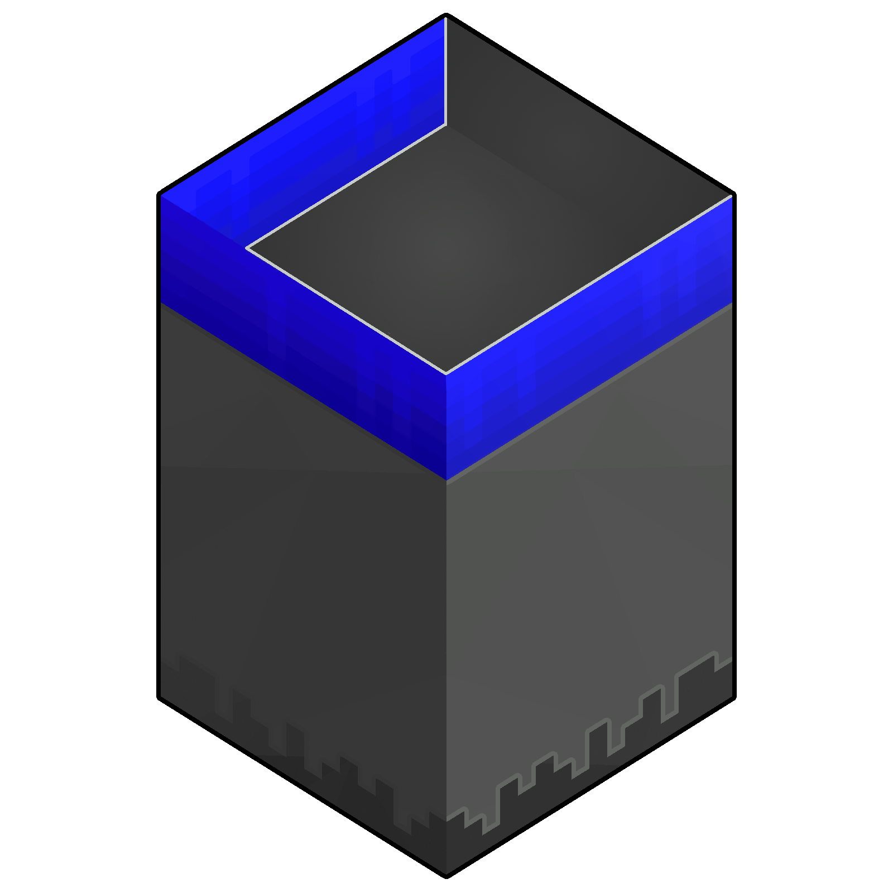

# ChunkAPI 

**[CurseForge](https://www.curseforge.com/minecraft/mc-mods/chunkapi) | [Modrinth](https://modrinth.com/mod/chunkapi)**

A mod for adding custom data to chunks without the hassle of writing custom packets, event handling,
loading hooks, and more.

### Licensed under the LGPLv3 license

### Originally developed by FalsePattern

### Mod logo by Houstonruss

Goals
-----

It is a goal to provide a way to add custom data to chunks without having to modify any vanilla classes.
The API will also provide a simple way to implement the custom serialization/deserialization of the data,
both for the networking and the NBT format.
An optional goal is to provide a way to register DFUs for the custom data, but this is not a priority.

Non-Goals
---------

It is not a goal to provide any kind of callback/hook system for anything except saving/loading and netcode, any kind
of extra behavior should be implemented in the mod using ChunkAPI.

Storage is not provided by the API, the user is expected to implement their own storage system. A good example
is using a mixin to add a field to the chunk class, and using that field to store the data.

Motivation
----------

Modifying chunk packet data involved incompatibly modifying network packets, the chunk class, and the anvil chunk loader,
which is a lot of work for a simple feature. This mod provides a way to add custom data to chunks without having
to modify any of the vanilla classes yourself.

API and spec
-----------

<!-- TODO update -->

The API exposes a way to add custom data to chunks, and a way to register custom serializers for the data.

### ChunkDataManager
The `ChunkDataManager` itself is the primary class used for managing registrations, but does not implement functionality
by itself. For that, you need to use the `PacketDataManager`, `ChunkNBTDataManager`, and `SectionNBTDataManager`
interfaces included inside the ChunkDataManager class.

### ChunkDataManager.PacketData
This interface is used for synchronizing data from the server to the client. If your data is only required on the server,
you can freely skip implementing this interface.

### ChunkDataManager.ChunkNBTData
This interface is used for saving/loading data from the chunk NBT. This is required if you want to keep persistent data
across world reloads. Note, if you store data *per block* in the chunk, you should use `SectionNBTData` instead, as it
is designed with the internal chunk format in mind.

### ChunkDataManager.SectionNBTData
This interface is mostly identical to `ChunkNBTData`, but is designed for storing data per block in the chunk.
Instead of being called once per chunk, it is called once per chunk section (16x16x16 blocks, `ExtendedBlockStage` class).

### ChunkDataRegistry
This is where you actually register your manager. You need to do all registrations inside the `init` phase.
You can also disable specific manager IDs by calling `disableDataManager`, but this is not recommended, and should
only be used if you know what you are doing. You need to do all the disabling inside the `postInit` phase.

### Packet specification

ChunkAPI modifies the S21PacketChunkData and S26PacketMapChunkBulk vanilla packets, and overwrites their default
formats.

All sizes in the tables below are specified in bytes.

S21PacketChunkData new format:

| Size (bytes) | Datatype | Name                       |
|--------------|----------|----------------------------|
| 4            | int      | X position                 |
| 4            | int      | Z position                 |
| 1            | bool     | Force Update               |
| 2            | short    | ExtendedBlockStorage mask  |
| 4            | int      | Uncompressed data length   |
| 4            | int      | (n) Compressed data length |
| n            | byte[n]  | Compressed data            |

S26PacketMapChunkBulk new format:

| Size (bytes) | Datatype             | Name                            |
|--------------|----------------------|---------------------------------|
| 2            | short                | (n) Chunk count in packet       |
| n * 4        | int[n]               | Uncompressed chunk data lengths |
| 4            | int                  | (m) Compressed data length      |
| 1            | 1                    | Contains skylight data          |
| m            | byte[m]              | Compressed data                 |
| n * 10       | (int, int, short)[n] | Chunk Headers (x, z, ebs mask)  |

In both cases, the compressed data is populated through the ChunkDataRegistryImpl.writeToBuffer method.
The layout of this data is as follows:

| Size (bytes) | Datatype | Name              |
|--------------|----------|-------------------|
| 4            | int      | (n) Manager count |
| n * varying  | MGRData  | Manager data      |

Manager data:

| Size (bytes) | Datatype  | Name                    |
|--------------|-----------|-------------------------|
| 4            | int       | (n) Manager name length |
| n            | UTF-8 str | Manager name            |
| 4            | int       | (m) Manager data length |
| m            | byte[m]   | Manager data            |

Dependencies
------------

[UniMixins](https://github.com/LegacyModdingMC/UniMixins)